# Overview
 - Traveling theta waves & their impact on place cell timing
 - Real-time position decoding
 - Slow-Wave Sleep in the awake Retrosplenial cortex

# Theta oscillations within CA1 differ in phase
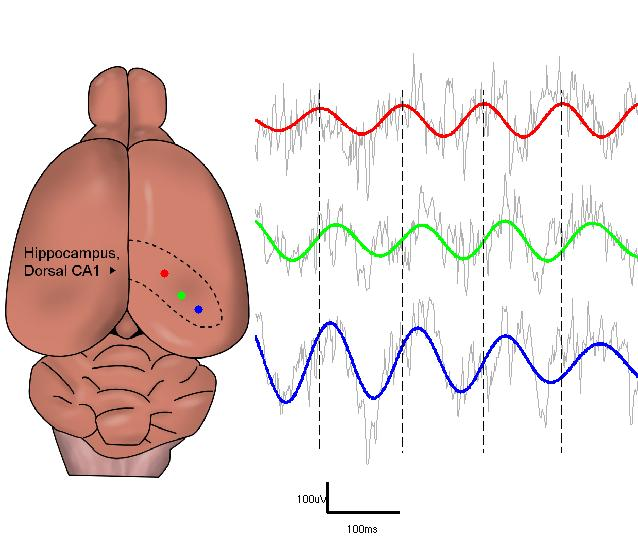

# Traveling wave is a good fit for profile of phase offsets 
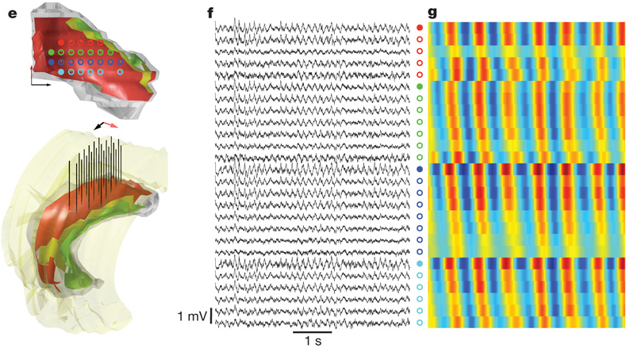

# Traveling wave is a good fit for profile of phase offsets 
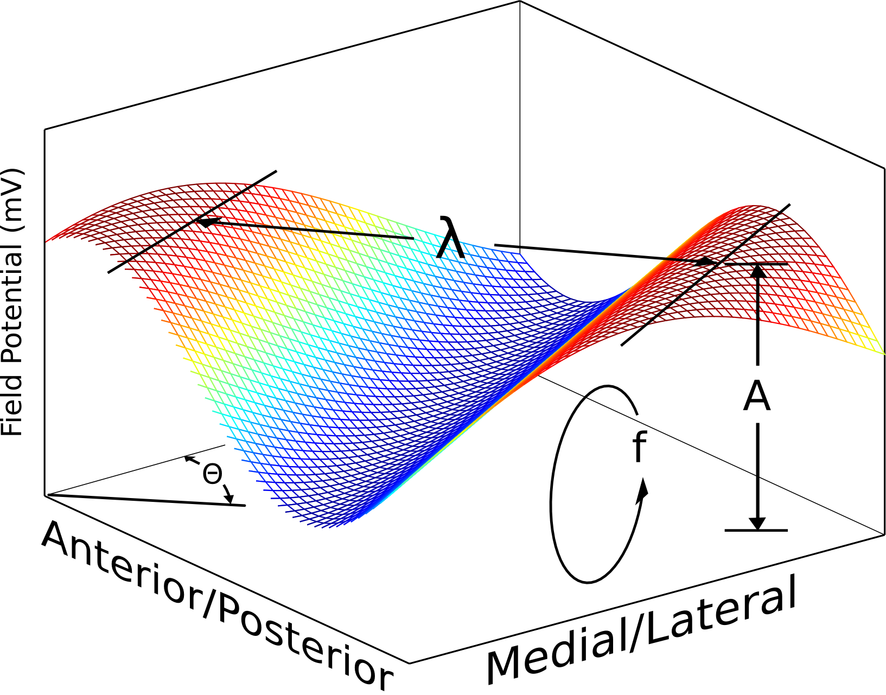

# Variability in traveling wave parameters
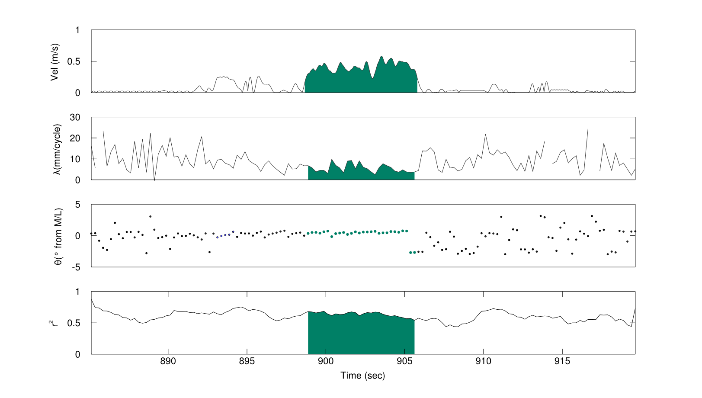

# Multi-unit spiking roughly follows the traveling wave
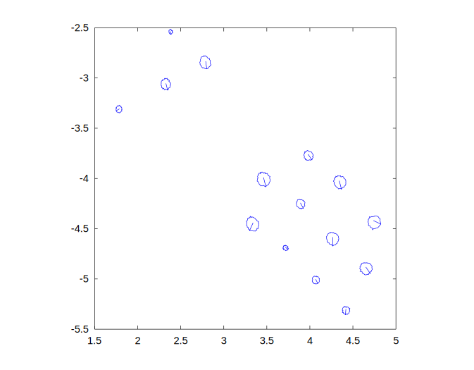

# "CA1 theta phase locking" becomes ambiguous. Which theta phase?
 - CA3/CA1, DG/CA1, EC/CA1, phase relationships (Mizuseki, 2012)
 - Specific +/- currents in various CA1 dendritic segments (Leung, 1984)
 - CA3/CA1 low gamma coupling, EC/CA1 high gamma coupling (Colgin, 2012)
 - PV cell, O-LM cell cell, septal cells firing phase (Freund, Klausburger) 
 - Functional roles for theta phases
 - **Theta phase precession**

# Place cell spike timing: theta sequences

 

## Two complementary views of theta sequences

  
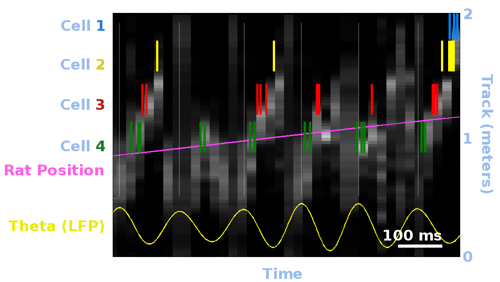

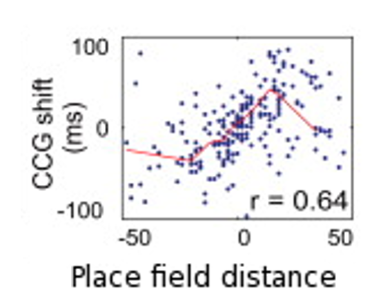

 

## View A

 - Reconstruct trace position
 - Time-compressed sequences every cycle
 - ~1 meter per theta cycle
 - ~8 meters per second (~15x speedup)

## View B

 - Time-x correlate place cell pairs
 - E.g. cell A is 0.4 meter beyond cell B,
 - Cell A fires 75 ms later
 - 5.3 meters/sec virtual running (~ 10x speedup)

# Accounting for traveling wave in theta sequences

 - Prediction
    - Find mean LFP traveling wave parameters
    - Convert to predicted time offset between anatomical points

 - Measurement
    - **View A** Divide cells into early/late theta groups and compare theta sequences
    - **View B** Factor anatomical separation into time offset regression

-  Technical limitations
    - Would like to partition cells into many small groups, 
      *but need many cells to decode theta sequences*
    - Would like to account for cycle-to-cycle variability, 
      *but have to pool data across time to overcome noise*
    - Compromise - focus on evaluating the simple case here 
      to answer basic question, followup with many more 
      tetrodes for more precise picture

# Traveling wave parameters and variability

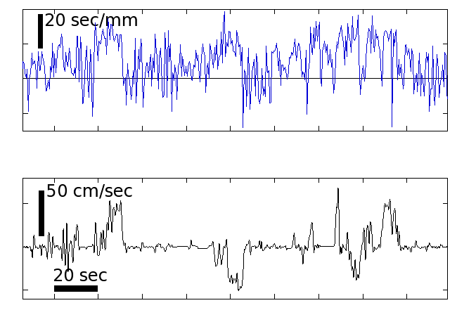

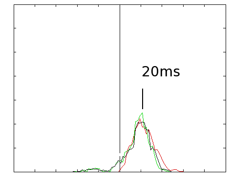

 

 - *Left top* Timecourse of expected time offset per anatomical mm along medial-lateral axis
 - *Left bottom* Running speed
 - *Right* Expected time-offset distribution along the medial-lateral axis

# Measuring timing differences in reconstructed theta sequences

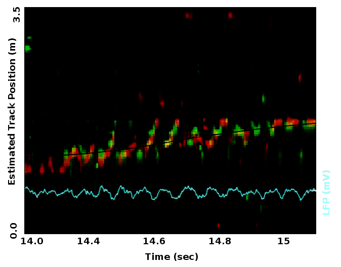

# Measuring timing differences in reconstructed theta sequences

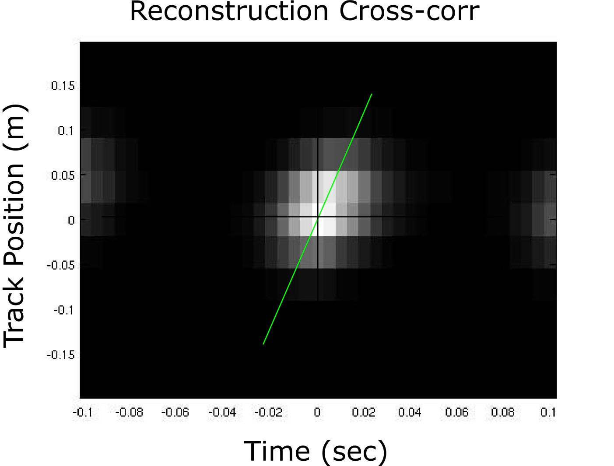

 - Replace x-corr with line-fit to triggered theta sequences.

# Measuring timing differences in place cell pairs

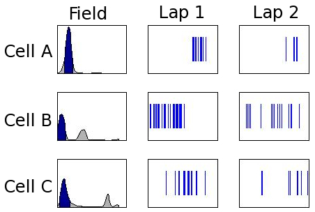

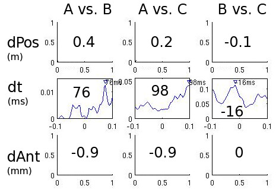

# Measuring timing differences in place cell pairs

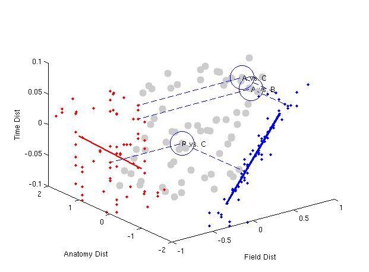

 
 
 
 
 

Factor     Coeff    95% C.I.
-------    -------- ---------
Field Pos  0.169    0.015
Anatomy    0.002    0.009
Offset     -0.001   0.006

# Interpretation

## Info coding decoupled from local excitatory drive timing

## Possible mechanisms (test w/ future experiments)

 - Local theta phase impacts theta sequence timing, but is counteracted by anatomically graded compensating excitation
 - Phase precession is inherited directly from upstream areas, upstream areas' theta sequences are aligned temporally, but with different rate prerefences (EC: nearby part of sequence, CA3: extended sequence). CA1 theta phase inherited according to input projection strength gradient

# Slow-wave sleep in the awake Retrosplenial cortex

# Behavioral & recording setup

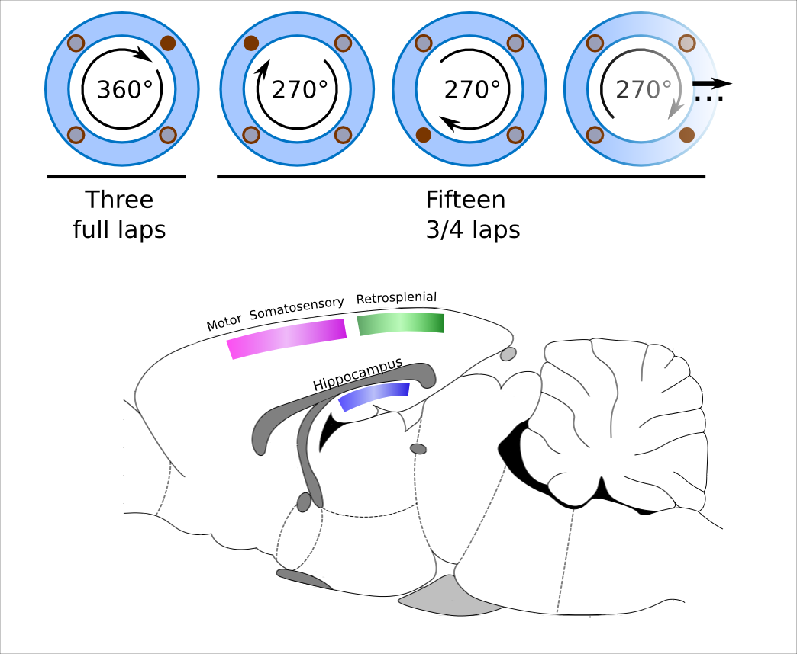

# Example cortical activity during slow-wave sleep

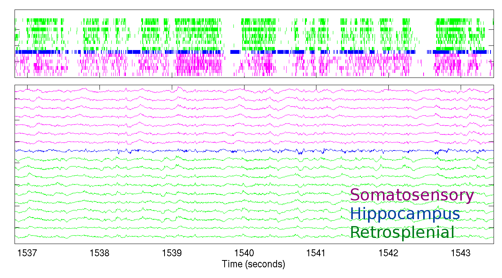

# Slow-wave like activity during run in retrosplenial cortex

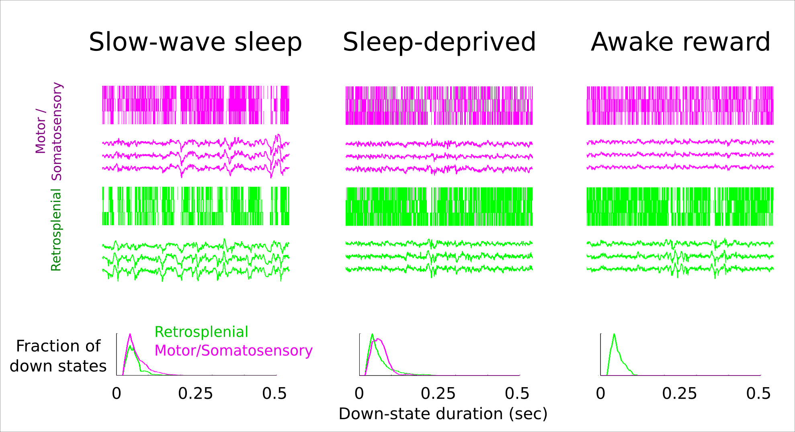

# Averaged LFP at time of down-state transition

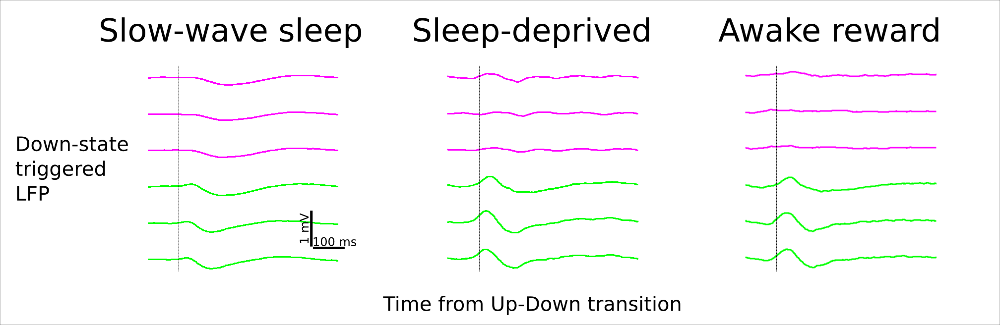

# Time coupling with hippocampus

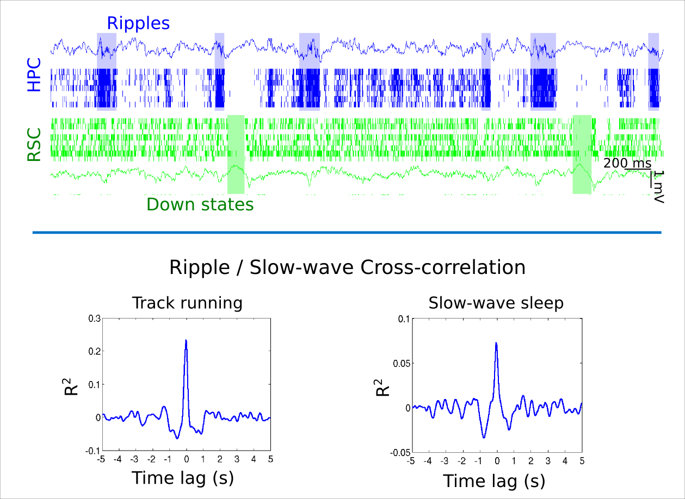
